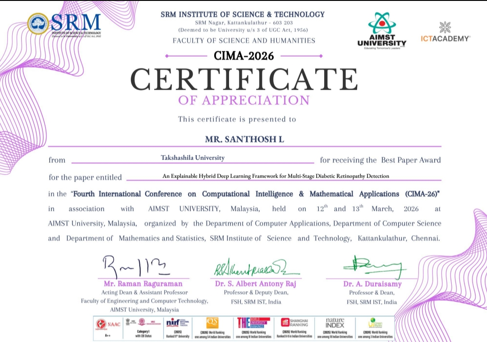

#  DR-Hybrid-XAI

## Explainable Hybrid Deep Learning Framework for Multi-Stage Diabetic Retinopathy Detection

<p align="center">


</p>

---

#  Introduction

Diabetic Retinopathy (DR) is one of the most serious complications caused by diabetes and is a leading cause of blindness worldwide. Early diagnosis is extremely important because delayed treatment may result in permanent vision loss.

Traditional retinal screening methods require experienced ophthalmologists and manual examination of retinal fundus images, which can be time-consuming and difficult in regions with limited medical resources.

This project presents an Explainable Artificial Intelligence based hybrid deep learning framework for automated diabetic retinopathy detection and classification. The proposed system combines the strengths of Convolutional Neural Networks (CNNs) and Vision Transformers to improve classification performance while integrating Explainable AI techniques to enhance transparency and clinical trust.

The framework is capable of:
- Detecting multiple stages of diabetic retinopathy
- Generating visual explanations using Grad-CAM
- Producing downloadable medical reports
- Providing a user-friendly Streamlit web application for real-time predictions

The primary goal of this project is to build a reliable, interpretable, and deployable AI-assisted healthcare solution for retinal disease screening.

---

#  Key Features

###  Hybrid Deep Learning Architecture
Combines CNN-based feature extraction with Transformer-based contextual learning for improved retinal image classification.

###  Multi-Stage Diabetic Retinopathy Detection
Classifies retinal fundus images into:
- No DR
- Mild DR
- Moderate DR
- Severe DR
- Proliferative DR

###  Explainable AI (XAI)
Integrates Grad-CAM heatmaps to visually explain which retinal regions influenced the model prediction.

###  Streamlit Web Application
Interactive user interface for:
- Image upload
- Prediction visualization
- Grad-CAM heatmap display
- PDF report generation

###  Automated Medical Report Generation
Generates professional PDF reports containing:
- Patient information
- Prediction results
- Confidence scores
- Visual explanations
- AI recommendations

###  Research-Oriented Workflow
Includes:
- Data preprocessing
- Model training
- Evaluation
- Explainability
- Deployment pipeline

---

#  System Workflow

```text
Fundus Image Input
        ↓
Image Preprocessing
        ↓
CNN Feature Extraction
        ↓
Transformer Context Learning
        ↓
Hybrid Classification Layer
        ↓
Grad-CAM Explainability
        ↓
Prediction + PDF Report
```

---

#  Proposed Architecture

The proposed framework follows an end-to-end medical AI pipeline for automated diabetic retinopathy analysis.

1. Retinal fundus images are collected and preprocessed.
2. Image enhancement and normalization techniques are applied.
3. CNN layers extract fine-grained retinal abnormalities.
4. Vision Transformer captures global spatial dependencies.
5. Hybrid features are fused for robust classification.
6. Grad-CAM generates visual explanations.
7. Predictions are displayed using a Streamlit web interface.
8. PDF diagnostic reports are generated automatically.

This hybrid approach improves both prediction accuracy and interpretability compared to traditional single-model approaches.

---

#  Model Performance

| Metric | Score |
|--------|--------|
| Accuracy | 92.3% |
| Precision | 91.8% |
| Recall | 92.1% |
| F1-Score | 91.9% |

The hybrid architecture achieved strong classification performance across multiple diabetic retinopathy severity levels while maintaining visual interpretability using Explainable AI techniques.

---

#  Explainable AI

Most traditional deep learning systems work as black-box models and do not provide reasoning behind predictions. This lack of interpretability reduces trust in clinical applications.

To address this limitation, this project integrates Grad-CAM (Gradient-weighted Class Activation Mapping).

Grad-CAM generates heatmaps that visually highlight important retinal regions responsible for the final prediction.

This improves:
- Transparency
- Clinical trust
- Model interpretability
- Decision support for ophthalmologists

---

#  Technologies Used

| Category | Technologies |
|----------|--------------|
| Programming | Python |
| Deep Learning | PyTorch |
| Web Framework | Streamlit |
| Image Processing | OpenCV |
| Visualization | Matplotlib |
| Data Handling | NumPy, Pandas |
| Explainability | Grad-CAM |
| Report Generation | ReportLab |

---

#  Project Structure

```text
DR-Hybrid-XAI/
│
├── app/
│   └── streamlit_app.py
│
├── models/
│   ├── baseline_cnn.py
│   └── hybrid_model.py
│
├── training/
│   ├── dataset.py
│   ├── preprocessing.py
│   ├── loss.py
│   ├── train_baseline.py
│   ├── train_hybrid.py
│   └── train_hybrid_research.py
│
├── evaluation/
│   └── roc_curve.py
│
├── screenshots/
│   ├── ui.png
│   ├── gradcam.png
│   ├── training.png
│   ├── report.png
│   └── award.png
│
├── predict.py
├── README.md
└── .gitignore
```

---

#  Installation Guide

##  Clone Repository

```bash
git clone https://github.com/santhoshloganathan01/DR-Hybrid-XAI.git
```

---

##  Navigate to Project Directory

```bash
cd DR-Hybrid-XAI
```

---

##  Install Required Packages

```bash
pip install -r requirements.txt
```

---

##  Run the Streamlit Application

```bash
streamlit run app/streamlit_app.py
```

---

# Application Preview

##  Web Application UI


---

##  Grad-CAM Heatmap


---

##  Training Performance


---

##  Diagnostic Report


---

#  Best Paper Award



---

#  Research Achievement

Received the **Best Paper Award** at the:

**Fourth International Conference on Computational Intelligence & Mathematical Applications (CIMA-2026)**

Research Paper:

> “An Explainable Hybrid Deep Learning Framework for Multi-Stage Diabetic Retinopathy Detection”

---

#  Objectives of the Project

- Improve diabetic retinopathy detection accuracy
- Reduce dependency on manual retinal screening
- Integrate Explainable AI in healthcare
- Provide real-time prediction capability
- Build a deployable clinical decision-support system

---

#  Future Enhancements

Future improvements for this project may include:

- Cloud deployment
- Mobile application integration
- Multi-disease retinal analysis
- Real-time clinical deployment
- Lightweight model optimization
- Advanced attention visualization techniques

---

#  Author

### Santhosh L

Artificial Intelligence & Data Science  
Takshashila University

Focused on:
- Artificial Intelligence
- Computer Vision
- Explainable AI
- Healthcare AI
- Deep Learning Research

---

#  License

This project is developed for academic, research, and educational purposes.
